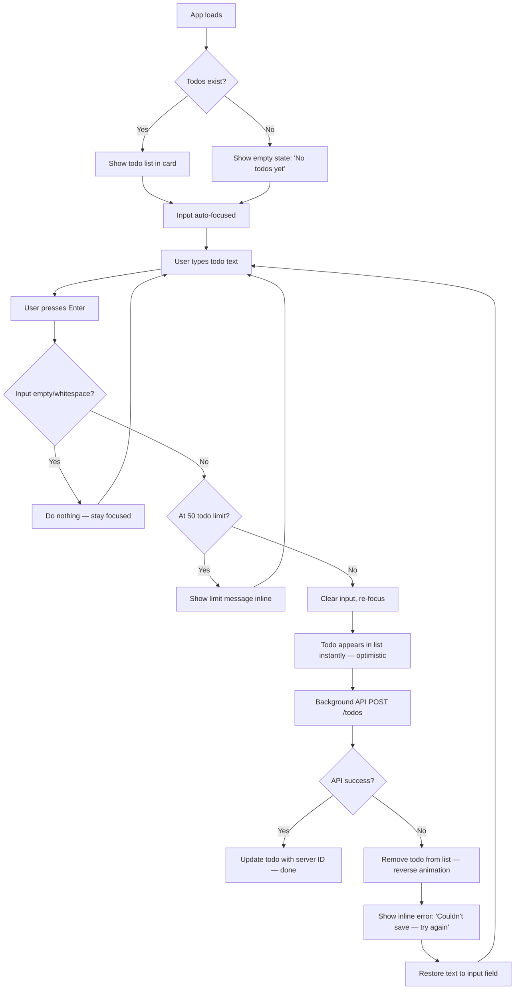
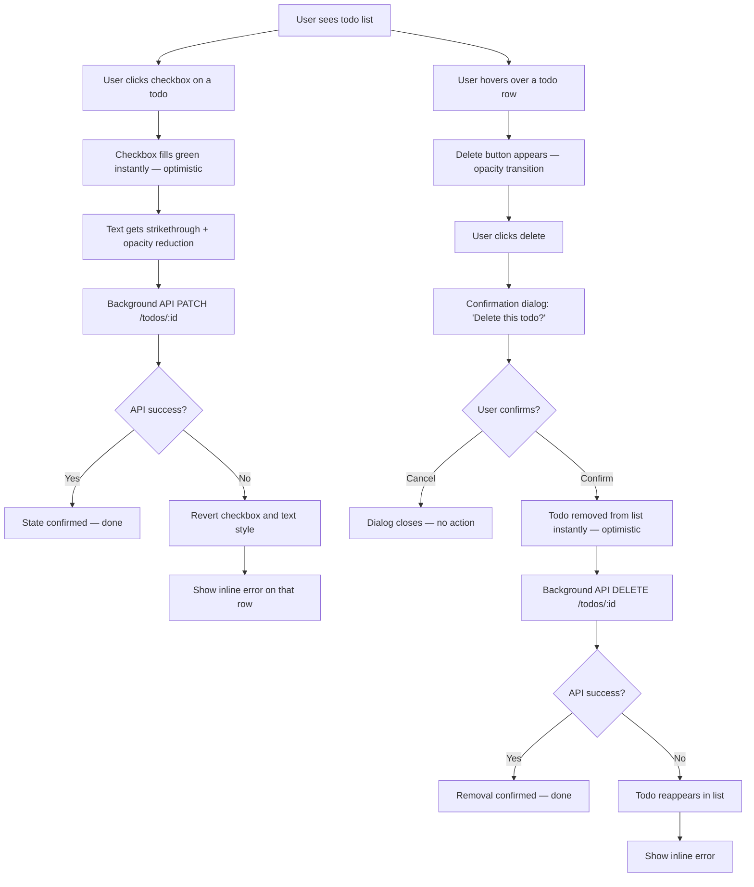
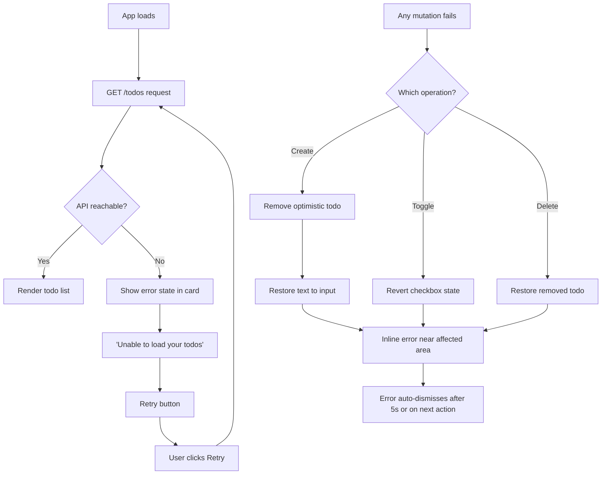

---
stepsCompleted:
  - step-01-init
  - step-02-discovery
  - step-03-core-experience
  - step-04-emotional-response
  - step-05-inspiration
  - step-06-design-system
  - step-07-defining-experience
  - step-08-visual-foundation
  - step-09-design-directions
  - step-10-user-journeys
  - step-11-component-strategy
  - step-12-ux-patterns
  - step-13-responsive-accessibility
  - step-14-complete
inputDocuments:
  - _bmad-output/planning-artifacts/prd.md
  - docs/Product Requirement Document (PRD) for the Todo App.md
  - docs/Technical Requirements.md
---

# UX Design Specification — mattodos

**Author:** Mattia
**Date:** 2026-03-04

---

## Executive Summary

### Project Vision

mattodos is a zero-friction personal todo manager where the simplicity is the product. The entire experience fits on a single screen: a text input and a list of todos. No onboarding, no configuration, no decisions. The user types, presses Enter, and gets back to work. The UX challenge is making that simplicity feel *intentional and polished* rather than unfinished — every interaction must be tight, responsive, and self-explanatory.

### Target Users

**Marco** — a developer who keeps a running list of what needs doing. Technically proficient, keyboard-first, zero tolerance for ceremony. Uses the app in two daily rituals: morning planning (add and triage) and end-of-day review (complete and clean up). Primary device is a laptop at a desk; occasionally checks from a phone. Expects the app to behave like a tool he's already used a hundred times.

### Key Design Challenges

1. **Intentional minimalism vs. emptiness.** One screen, four actions, no navigation. The visual design must communicate "this is all you need" — not "this is all we built." Typography, spacing, empty state copy, and micro-interactions carry the entire personality.
2. **Optimistic UI trust.** Every action reflects instantly before the server confirms. When sync fails, the rollback must feel smooth and informative — not like the app lied to the user. The error pattern needs to maintain confidence in the tool.
3. **Delete confirmation without drag.** Confirmation dialogs interrupt flow. The prompt must feel protective (catching mistakes) without feeling like a nag (blocking intentional deletes). Placement, wording, and dismissal speed all matter.

### Design Opportunities

1. **Micro-interactions as brand.** In an app with no branding surface, the *feel* of creating, completing, and deleting todos becomes the identity. Subtle entrance animations, satisfying completion transitions, and clean delete exits can make the app memorable without adding features.
2. **Empty state as welcome mat.** The empty state is the first impression for every new user and the reward for every productive user who clears their list. It should set the tone and gently nudge the first action — without feeling like onboarding.
3. **Completion as satisfaction.** Marco's end-of-day review should feel *good*. The visual hierarchy between active and completed todos, and the act of checking things off, is a chance to make productivity feel tangible and rewarding.

## Core User Experience

### Defining Experience

The defining interaction is **type → Enter → done**. That three-beat rhythm — fingers on keyboard, text appears, todo exists — is the heartbeat of the app. Everything else (completing, deleting, reviewing) serves that loop. If adding a todo feels instant and effortless, the app works. If it doesn't, nothing else matters.

The entire surface area is four actions on a single screen: create, view, toggle complete, delete. There is no navigation, no modes, no views to switch between. The mental model is a piece of paper with checkboxes.

### Platform Strategy

- **Platform:** Web SPA — single page, no navigation, no routing needed beyond the one view
- **Primary context:** Desktop — Marco at his desk with a keyboard
- **Secondary context:** Mobile — full feature parity with touch-friendly targets
- **Breakpoint:** One (~768px), two layouts. Mobile-first CSS.
- **No offline mode.** No native apps. No PWA install prompt. The browser tab *is* the app.

### Effortless Interactions

- **Adding a todo** requires zero decisions. Type, Enter. No category picker, no priority dropdown, no date selector. The input field is always visible and always focused on load.
- **Completing a todo** is a single click/tap — the visual shift should feel satisfying, not just functional.
- **Reviewing the list** is instant — the page loads and the list is *there*. No spinner beyond a blink, no skeleton screens, no flash of empty content. Yesterday's state, ready to go.
- **Error recovery** is invisible when possible and effortless when not. Rollback happens automatically; the user only sees an error message if they need to act.

### Critical Success Moments

1. **First load** — Marco opens the tab and his list from yesterday is already there. Trust established in one second.
2. **First todo created** — Type, Enter, it appears. "This just works."
3. **End-of-day check-off** — Three todos completed in rapid succession. Each one visually shifts. The list feels lighter. That's satisfaction.
4. **Sync failure recovery** — The API hiccups. The todo reverts. A clear message appears. Marco retries, it works. Trust maintained.

### Experience Principles

1. **Instant over accurate.** Show the result immediately — reconcile with the server afterward. The user's perception of speed matters more than actual round-trip time.
2. **Silent when right, clear when wrong.** No success toasts, no confirmation messages for happy paths. Reserve UI communication for when something needs attention.
3. **The list is the interface.** No navigation, no views, no modes. What you see is all there is.
4. **Keyboard-first, touch-ready.** Design for the developer at a desk, then ensure it works perfectly for the phone in hand.

## Desired Emotional Response

### Primary Emotional Goals

- **Competence.** Marco should feel like he's got his day under control. Not motivated, not inspired — just organized. The feeling of writing a clean list on a notepad and putting it where you can see it.
- **Trust.** The app does what he told it to and remembers what he left. Every time. No surprises, no lost data, no "did that save?" doubt.
- **Momentum.** Adding todos is fast. Completing them is satisfying. The app should never slow Marco down or make him think about the app itself — only about his work.

### Emotional Journey Mapping

| Moment | Desired Feeling | Design Lever |
|---|---|---|
| First visit (empty state) | Curiosity + clarity — "I know exactly what to do" | Welcoming empty state copy, visible input field, no intimidation |
| Adding first todo | Instant gratification — "That was effortless" | Immediate appearance, subtle entrance animation |
| Returning next day | Reliability — "It's all still here" | Instant load, no loading state visible |
| Completing a todo | Quiet satisfaction — "Progress" | Visual completion transition, reduced visual weight |
| Clearing the list | Accomplishment — "Done for the day" | Return to a warm empty state, not a dead screen |
| Sync failure | Calm confidence — "Something went wrong but I'm not losing anything" | Smooth rollback, clear error, obvious retry |
| Delete confirmation | Protected, not nagged — "Good, it caught that" | Fast dialog, specific wording, easy escape |

### Micro-Emotions

- **Confidence over confusion** — every element is self-explanatory. No ambiguity about what a click will do.
- **Trust over skepticism** — optimistic UI means "I see it, so it's done." Rollback must preserve that trust rather than shatter it.
- **Accomplishment over frustration** — completing todos should feel *good*. The visual shift is the reward.

### Emotions to Avoid

- **Anxiety** — "Did it save?" "Where did it go?" "What does this button do?"
- **Guilt** — No gamification, no streaks, no "you haven't added a todo today." The app is a tool, not a coach.
- **Overwhelm** — Even at 50 todos, the list should feel manageable, not oppressive.

### Emotional Design Principles

1. **Calm confidence.** The app feels reliable the way a good notebook feels reliable — you write in it, you close it, it's there tomorrow. No fanfare.
2. **Reward through reduction.** The satisfaction comes from completing and removing, not from collecting and accumulating. A shorter list is a better list.
3. **Invisible when working, present when needed.** Happy paths are silent. Errors speak up clearly. The app stays out of the way until it has something important to say.

## UX Pattern Analysis & Inspiration

### Inspiring Products Analysis

**Google Finance** — Mastery of glanceable information density. The interface *is* the data — no chrome between the user and what they came for. Instant load, sharp visual hierarchy (what's up is green, what's down is red), zero onboarding. Trust the user to scan and interpret.

**Instagram** — Best-in-class optimistic UI and micro-interaction design. Actions (like, save) register instantly with satisfying visual feedback before server confirmation. The double-tap heart animation proves that a tiny interaction can carry emotional weight. Smooth, predictable scrolling sets the rhythm.

**Tinder** — The platonic ideal of one-interaction simplicity. Swipe = decide. The entire product fits in a single gesture with clear physical feedback (card flies away). No modes, no navigation, no configuration. The interaction *is* the product.

### Transferable UX Patterns

| Pattern | Source | Application in mattodos |
|---|---|---|
| Data-is-the-interface | Google Finance | The todo list loads instantly and *is* the entire UI. No wrapper UI around it. |
| Glanceable status hierarchy | Google Finance | Active vs. completed todos need the same instant-scan clarity as green/red numbers. |
| Optimistic action feedback | Instagram | Checkbox toggles, new todo appearance, and deletes all respond before server confirms. |
| Satisfying micro-interaction | Instagram | Completion toggle gets a subtle but rewarding visual transition — not just a state swap. |
| Single-gesture directness | Tinder | Each action (type+Enter, click checkbox, click delete) maps 1:1 to a result. No intermediate screens. |
| Decisive momentum | Tinder | Complete a todo and move on. The UI encourages forward motion, not deliberation. |

### Anti-Patterns to Avoid

- **Loading walls** — Never show a full-screen loader. If data takes >200ms, show the shell immediately with a subtle indicator.
- **Confirmation fatigue** — Only confirm destructive actions (delete). Never confirm creates or toggles.
- **Toast spam** — No "Todo created successfully!" toasts. Silence on happy path. The visual result *is* the confirmation.
- **Hover-only affordances** — All interactive elements must be visually discoverable. Don't hide the delete button behind hover (breaks mobile, breaks accessibility).
- **Animation overload** — Micro-interactions should be quick (~150-250ms) and subtle. Nothing that makes the user wait or feels performative.

### Design Inspiration Strategy

**Adopt:**
- Google Finance's "the data IS the interface" philosophy — the todo list is the page, not content wrapped in a page
- Instagram's optimistic UI pattern — every action reflects instantly, reconcile later
- Tinder's one-action directness — no intermediate states between user intent and result

**Adapt:**
- Instagram's micro-interaction satisfaction (scaled down) — subtle completion transition, gentle entrance animation for new todos, clean exit for deletes. Nothing as dramatic as a heart burst, but that same principle of *interaction as reward*.
- Google Finance's visual hierarchy — active todos in full contrast, completed todos visually receded (lower opacity, strikethrough, muted color)

**Avoid:**
- Instagram's infinite scroll complexity — mattodos has a fixed list, not a feed
- Tinder's gamification undertone — no streaks, no rewards, no "you completed 5 todos today!"
- Any pattern that adds motion/delay between intent and result

## Design System Foundation

### Design System Choice

**Tailwind CSS** — utility-first CSS framework. No component library. Custom components built with semantic HTML and Tailwind utility classes.

### Rationale for Selection

1. **Right-sized for the scope.** mattodos has ~6 UI elements (input, todo item, checkbox, delete button, confirmation dialog, state screens). A component library designed for 200+ components is architectural overkill.
2. **Full visual control.** The app's personality lives in spacing, typography, and micro-interactions — not in pre-built widget styles. Tailwind gives design tokens without imposing component opinions.
3. **Minimal production bundle.** PurgeCSS strips unused utilities at build time. Aligns with NFR4 (minimal bundle size) — production CSS will be a few KB.
4. **Accessibility is explicit.** No library "magic" that may or may not be WCAG AA. Every ARIA attribute, keyboard handler, and focus trap is hand-written and intentional — valuable for a learning project.
5. **Portfolio-appropriate.** Demonstrates design ownership rather than library configuration. Shows the developer chose *how* things look, not just *which* library to install.

### Implementation Approach

- **Tailwind config** defines the design token system: color palette, spacing scale, typography scale, border radii, shadows, transition durations
- **Utility composition** via `@apply` in component-scoped styles for repeated patterns (e.g., todo item row, button variants)
- **Semantic HTML first** — structure with proper elements (`<main>`, `<ul>`, `<li>`, `<button>`, `<input>`) before applying utilities
- **CSS transitions** for micro-interactions (completion toggle, entrance/exit animations) — no animation library needed
- **Dark mode:** Not in MVP scope. Tailwind's `dark:` variant makes it trivial to add later without refactoring.

### Customization Strategy

- **Design tokens in `tailwind.config.js`:** Brand colors, spacing scale, font stack, border radius defaults, transition timing
- **Component patterns documented:** Each UI element (todo item, input, button, dialog, state screen) gets a consistent utility pattern
- **No `@apply` overuse:** Keep utilities inline where they're used once. Extract only repeated multi-class patterns.
- **Responsive via Tailwind breakpoints:** `sm:` prefix for mobile-first overrides at ~768px

## Defining Core Experience

### The Defining Experience

**In one sentence:** "Add a thought to your list as fast as you can think it."

**The interaction:** Type → Enter → it's there. Three beats. No decisions between "I have a thought" and "it's on my list." This is the Tinder swipe of mattodos — the single interaction that, if nailed, makes everything else follow. The pattern is entirely established (text input + Enter = create), requiring zero user education. The innovation is *quality of execution*: optimistic UI makes the gap between intent and result imperceptible.

### User Mental Model

Marco thinks of this like a **sticky note pad**. You grab a pen, scribble a line, and it's done. You don't "save" a sticky note. You don't confirm you want to write on it. The mental model is *writing*, not *data entry*.

**Analogies that match this model:**
- **Apple Notes** — type and it's saved. No explicit save action.
- **Terminal** — type a command, hit Enter, see the result. Instant feedback loop.
- **Google search bar** — type, Enter, result. The input field *is* the product.

**What breaks this model:**
- Required fields beyond text (category, priority, date)
- A "Submit" or "Add" button that requires a separate click
- A success message after creation ("Todo added!") — congratulating the user for writing a note is patronizing

### Success Criteria

| Signal | What it means |
|---|---|
| User never reaches for a mouse to create a todo | Keyboard flow is complete |
| User adds 3 todos in under 10 seconds | The rhythm is unbroken |
| User doesn't look for a "save" indicator | They trust the system saved it |
| Input field is cleared and re-focused after Enter | Ready for the next thought |
| New todo appears at predictable position in list | No spatial confusion |

### Pattern Analysis

**Entirely established patterns.** Nothing novel needed. The interaction vocabulary is:
- Text input + Enter = create (universal web pattern)
- Checkbox = toggle state (universal)
- Trash/X icon = delete (universal)
- List = ordered collection (universal)

The unique twist is *quality of execution*: optimistic UI makes each pattern feel faster than the user expects. The gap between "I did something" and "I see the result" is imperceptible.

### Experience Mechanics

**1. Initiation:** Input field is visible and auto-focused on page load. Cursor blinks. Subtle placeholder: "What needs to be done?" — disappears on focus, doesn't compete with typing.

**2. Interaction:** User types. No character counter, no live validation, no formatting. Just text appearing in a field. Enter submits. The field clears. Focus stays in the input.

**3. Feedback:** New todo appears in the list instantly (optimistic). Subtle entrance animation (fade in + slight slide, ~200ms). No toast, no flash, no "added!" message. The visual appearance of the todo *is* the confirmation.

**4. Completion:** The input is empty and re-focused. The user's fingers never left the keyboard. They can immediately type the next todo or stop. The list now has one more item. Done.

**5. Failure (sync fails):** The todo that appeared optimistically reverts out (reverse of entrance animation). An inline error appears near the input: "Couldn't save that — try again." The user's text is *not* lost — it reappears in the input field so they can retry with Enter.

## Visual Design Foundation

### Color System

**Palette Family:** Stone / Warm Gray — grounded, calm, lets content lead.

| Role | Token | Value | Usage |
|---|---|---|---|
| Background | `bg-stone-50` | `#FAFAF9` | Page background |
| Surface | `bg-white` | `#FFFFFF` | Card / list container |
| Text — primary | `text-stone-900` | `#1C1917` | Todo text, headings |
| Text — secondary | `text-stone-500` | `#78716C` | Timestamps, helper text |
| Text — muted | `text-stone-400` | `#A8A29E` | Placeholder, disabled |
| Border | `border-stone-200` | `#E7E5E4` | Dividers, input border |
| Accent | `text-slate-600` | `#475569` | Focus ring, active indicator |
| Success | `text-green-600` | `#16A34A` | Completed checkmark |
| Error — text | `text-red-600` | `#DC2626` | Error messages |
| Error — bg | `bg-red-50` | `#FEF2F2` | Error banner background |

**Design Rationale:** Warm grays (Stone) instead of cool grays (Zinc/Slate) because the app should feel personal and approachable, not clinical. The palette is intentionally narrow — two accent colors (slate for interactivity, green for success) and one alert color (red). No blues, no purples, no gradients.

### Typography System

**Font Stack:** System fonts — zero download, instant render, native feel.

```css
font-family: -apple-system, BlinkMacSystemFont, 'Segoe UI', Roboto, Oxygen, Ubuntu, Cantarell, 'Open Sans', 'Helvetica Neue', sans-serif;
```

**Type Scale (flat — no dramatic hierarchy):**

| Role | Size | Weight | Token |
|---|---|---|---|
| Page title | 24px / 1.5rem | 600 (semibold) | `text-2xl font-semibold` |
| Section label | 14px / 0.875rem | 500 (medium) | `text-sm font-medium` |
| Todo text | 16px / 1rem | 400 (normal) | `text-base` |
| Helper text | 14px / 0.875rem | 400 (normal) | `text-sm` |
| Small text | 12px / 0.75rem | 400 (normal) | `text-xs` |

**Rationale:** Flat scale because the content is flat — one entity type (todo), one list. A dramatic type hierarchy would imply structure that doesn't exist. The 16px base ensures readability; system fonts ensure the app feels native to every platform.

### Spacing & Layout Foundation

**Base Unit:** 4px — all spacing derives from this.

| Token | Value | Usage |
|---|---|---|
| `space-1` | 4px | Tight inline gaps |
| `space-2` | 8px | Icon-to-text, compact padding |
| `space-3` | 12px | Input internal padding |
| `space-4` | 16px | Standard element padding |
| `space-6` | 24px | Section spacing |
| `space-8` | 32px | Major section breaks |
| `space-12` | 48px | Page-level vertical rhythm |

**Layout Model:** Single centered column, max-width ~640px, auto margins. Mobile-first — on narrow screens the column fills the viewport with horizontal padding (`space-4`). On wider screens the max-width constrains the list to a comfortable reading width.

**Why 640px?** Todo descriptions are short text. A wider container wastes space and forces the eye to travel too far. 640px keeps every todo item scannable in a single glance.

### Accessibility Considerations

- **Color is never the sole indicator** — completed todos use strikethrough + opacity reduction, not just color change.
- **Focus rings are visible** — `ring-2 ring-slate-600 ring-offset-2` on all interactive elements. Never removed, never hidden.
- **Motion is respectful** — all animations honor `prefers-reduced-motion: reduce`. Optimistic UI works without animation.
- **Touch targets** — minimum 44×44px for all interactive elements on mobile.
- **Contrast verified** — Stone-900 on Stone-50 = ~15.4:1 (exceeds AAA). Stone-500 on white = ~5.0:1 (passes AA). Green-600 on white = ~4.5:1 (passes AA minimum).

## Design Direction Decision

### Design Directions Explored

Four visual directions were generated, each applying the same Stone palette, system fonts, and centered 640px column layout with different visual treatments:

| Direction | Name | Character | Key Traits |
|---|---|---|---|
| 1 | Clean Sheet | Minimalist extreme | No container, content floats in white space, underline input, circle checkboxes |
| 2 | Soft Container | Notepad on a desk | White card on warm background, subtle shadow, row hover states, rounded checkboxes |
| 3 | Dense & Efficient | Power-user optimized | Compact rows, monospace input, data-dense, smaller type, inspired by Google Finance |
| 4 | Warm & Personal | Friendly and generous | Large border-radius (20px), animated checkbox fill, conversational microcopy, Tinder-inspired warmth |

All four directions are viewable in the interactive HTML showcase: `ux-design-directions.html`

### Chosen Direction

**Direction 4: Warm & Personal** — friendly, generous radii, animated feedback, conversational tone on a warm Stone-50 background.

### Design Rationale

1. **Emotional alignment.** The primary emotional goals are competence, trust, and *momentum*. Direction 4's animated checkbox fill (green circle expanding on complete) creates a satisfying micro-moment that reinforces momentum — every completion *feels* like progress. The other directions lack this tactile feedback.

2. **Personality without complexity.** mattodos is a personal tool — it should feel like *yours*, not like enterprise software. The generous border-radius (`rounded-2xl` / 20px), conversational placeholder ("What's on your mind?"), and warm shadow tones give the app a friendly character that Direction 2's clinical card and Direction 3's data density don't achieve.

3. **Tinder-inspired single-focus warmth.** From our inspiration analysis, Tinder's transferable pattern was "single-gesture directness with satisfying feedback." Direction 4 is the only variation that fully commits to this — the animated checkbox is that satisfying feedback moment. Each interaction has a small payoff.

4. **Still grounded by the card.** Direction 4 uses a card container like Direction 2, so the "notepad on a desk" mental model is preserved. The card just has warmer, more generous proportions — it feels more like a personal notebook than a clinical form.

5. **The subtitle adds context without clutter.** "Your tasks, your pace." beneath the title sets an emotional tone in 4 words. It's not functional UI — it's a personality touch that makes the app feel intentionally designed.

### Implementation Approach

**Layout Structure:**
```
<body>  →  bg-stone-50, min-h-screen
  <main>  →  max-w-[560px], mx-auto, px-4, py-12
    <h1>  →  text-2xl, font-semibold, mb-2
    <p>   →  text-sm, text-stone-500, mb-6  ("Your tasks, your pace.")
    <div>  →  bg-white, rounded-2xl, shadow-[0_2px_12px_rgba(28,25,23,0.06)], overflow-hidden  (the card)
      <div>  →  p-5, (input area)
        <input>  →  w-full, border, rounded-xl, px-[18px], py-3.5
      <ul>  →  divide-y divide-stone-100  (todo list)
        <li>  →  flex, items-center, gap-3.5, px-5, py-3.5, hover:bg-[#FEFDFB]
      <footer>  →  px-5, py-3.5, border-t, text-sm, text-stone-400  (counts)
```

**Key Visual Decisions:**
- Card shadow: warm-tinted `0 2px 12px rgba(28,25,23,0.06)` — softer and warmer than `shadow-sm`
- Card radius: `rounded-2xl` (16px on card, 12px on input — generous but not cartoonish)
- Checkbox: 24px circle, 2px border — on completion, fills green with a scale pop animation (`0 → 1.2 → 1` over 300ms, cubic-bezier easing)
- Completed text: `line-through` + `opacity-40` (stronger fade than Direction 2's 50%)
- Row hover: `bg-[#FEFDFB]` — a barely-warm white, softer than Stone-50
- Delete button: circular 28px hit area, hidden by default, appears on row hover, red background on hover (`bg-red-50`)
- Input placeholder: conversational — "What's on your mind?" (not "What needs to be done?")
- Footer: split layout — "2 remaining" left, "4 total" right
- All animations respect `prefers-reduced-motion: reduce`

## User Journey Flows

### Journey 1: Create Todos (Morning Planning)

**Entry:** User opens app → sees persisted list from previous session. Input field is auto-focused.



**Key UX decisions:**
- Input is *always* focused after any action — never breaks the typing rhythm
- Empty input → silent no-op (no error toast, no shake, no red border)
- Limit message appears *inline* below the input, not as a modal
- On sync failure: todo text returns to input so user can retry with Enter

### Journey 2: Complete & Review (End-of-Day)

**Entry:** User returns to existing tab or opens app. List loads from API.



**Key UX decisions:**
- Toggle is a single click/tap — no intermediate state
- Completed todos stay in place (no reordering/grouping) — predictable position
- Delete requires confirmation — but it's a simple dialog, not a toast with undo timer
- Errors appear *on the affected row*, not as a global banner

### Journey 3: Error & Edge Cases

**Entry:** Various failure states.



**Key UX decisions:**
- Loading state: skeleton or subtle spinner *inside the card* — the card shell renders immediately
- Error state lives inside the card — the page structure (header + card) is always visible
- Retry is a single button, not a "pull to refresh" or page reload
- Inline errors auto-dismiss — they don't pile up or require manual closing

### Journey Patterns

| Pattern | Description | Used In |
|---|---|---|
| **Optimistic Mutation** | Reflect change instantly, sync in background, revert on failure | Create, Toggle, Delete |
| **Inline Error** | Error message appears near the affected element, not as a global toast | All mutation failures |
| **Silent Validation** | Invalid input is ignored without error feedback | Empty todo submission |
| **Progressive Disclosure** | Delete button hidden until row hover/focus | Todo row interaction |
| **Persistent Focus** | Input field maintains focus across all operations | Create flow |
| **Confirmation Gate** | Destructive action requires explicit confirmation | Delete only |

### Flow Optimization Principles

1. **Zero navigation.** Every journey happens on one screen. There are no routes, no pages, no "back" button. The card *is* the entire app.

2. **Errors are local, not global.** A failed toggle doesn't block new todo creation. Each mutation's error state is scoped to its own row or area.

3. **User text is sacred.** If a create fails, the text returns to the input. The user never has to retype.

4. **Feedback is proportional.** Success = subtle (item appears). Failure = noticeable but not alarming (inline message). Destruction = gated (confirmation dialog).

5. **Recovery is always one action away.** Error state → Retry button. Failed create → Enter again. Failed toggle → click again.

## Component Strategy

### Design System Components

**Tailwind CSS provides zero pre-built components** — it provides design tokens (colors, spacing, typography, radii, shadows) as utility classes. Every UI component is custom-built, giving full control over the Warm & Personal design direction.

**Tailwind foundation layer:**

| Category | What It Covers |
|---|---|
| Color | Stone palette, slate accent, green success, red error — all as utilities |
| Typography | System font stack, size/weight utilities |
| Spacing | 4px-based scale via `p-*`, `m-*`, `gap-*` |
| Layout | Flexbox, grid, max-width, centering |
| Borders & Radii | `rounded-2xl`, `rounded-xl`, `border-stone-*` |
| Shadows | Custom warm shadow via arbitrary values |
| Transitions | `transition-all`, `duration-*`, cubic-bezier via config |
| Responsive | `sm:`, `md:` breakpoint prefixes |
| Accessibility | `focus:ring-*`, `sr-only`, `prefers-reduced-motion` |

### Custom Components

**7 components** cover the entire app.

#### TodoInput

**Purpose:** Captures new todo text. The primary entry point — always visible, always focused.

**Anatomy:** Rounded input field (`rounded-xl`) inside the card's top section. Placeholder: "What's on your mind?" No visible submit button — Enter key submits.

| State | Visual |
|---|---|
| Default | `border-stone-200`, placeholder visible |
| Focused | `border-slate-600`, `ring-4 ring-slate-600/8`, placeholder hidden |
| Disabled (at limit) | `opacity-50`, placeholder: "Todo limit reached" |

**Accessibility:** `aria-label="Add a new todo"`, `role="textbox"`, Enter triggers form submission.

#### TodoItem

**Purpose:** Displays a single todo with checkbox, text, timestamp, and delete action.

**Anatomy:** Row: `flex items-center gap-3.5 px-5 py-3.5`. Checkbox (left) → Text (flex-1) → Timestamp (right) → Delete button (right, hidden by default).

| State | Visual |
|---|---|
| Active | Normal text, empty checkbox circle |
| Completed | `line-through`, `opacity-40`, green-filled checkbox with pop animation |
| Hover | `bg-[#FEFDFB]`, delete button fades in |
| Syncing (optimistic) | Normal appearance — indistinguishable from confirmed |
| Error (sync failed) | Inline error message appears below the row |

**Accessibility:** `role="listitem"`, checkbox is `role="checkbox"` with `aria-checked`, `aria-label` includes todo text.

#### TodoCheckbox

**Purpose:** Toggle completion state with satisfying animated feedback.

**Anatomy:** 24px circle, 2px border. On completion: green fill with scale pop animation (`0 → 1.2 → 1`, 300ms). Checkmark appears inside.

| State | Visual |
|---|---|
| Unchecked | `border-stone-300`, empty |
| Hover | `border-green-600` |
| Checked | `bg-green-600 border-green-600`, white checkmark, pop animation |
| Focus | `ring-2 ring-slate-600 ring-offset-2` |

**Accessibility:** `role="checkbox"`, `aria-checked="true|false"`, `aria-label="Mark [todo text] as complete"`, keyboard: Space/Enter toggles.

#### DeleteButton

**Purpose:** Remove a todo. Progressive disclosure — only visible on row interaction.

**Anatomy:** 28px circular hit area, `×` icon centered.

| State | Visual |
|---|---|
| Hidden | `opacity-0` (default) |
| Visible | `opacity-100` (on row hover or focus-within) |
| Hover | `bg-red-50`, `text-red-600` |
| Focus | `ring-2 ring-slate-600 ring-offset-2`, always visible |

**Accessibility:** `aria-label="Delete [todo text]"`, `role="button"`, keyboard-focusable (always reachable via Tab even when visually hidden).

#### ConfirmDialog

**Purpose:** Gate destructive delete action with explicit confirmation.

**Anatomy:** Modal overlay (`bg-black/20`), centered card (`rounded-2xl`, warm shadow), text: "Delete '[todo text]'?", two buttons: Cancel (secondary) and Delete (destructive red).

| State | Visual |
|---|---|
| Closed | Not rendered |
| Open | Overlay + centered dialog, focus trapped inside |
| Cancel hover | `bg-stone-100` |
| Delete hover | `bg-red-600 text-white` |

**Accessibility:** `role="alertdialog"`, `aria-labelledby` pointing to question text, focus trap, Escape closes, auto-focus on Cancel (safe default).

#### InlineError

**Purpose:** Display mutation failure messages scoped to the affected area.

**Anatomy:** Compact row below affected element. `bg-red-50 text-red-600 text-sm rounded-lg px-4 py-2`. Auto-dismisses after 5 seconds or on next user action.

| State | Visual |
|---|---|
| Hidden | Not rendered |
| Visible | Fade-in, red background, error text |
| Dismissing | Fade-out after 5s timeout |

**Accessibility:** `role="alert"`, `aria-live="polite"` — screen readers announce without interrupting.

#### AppStateDisplay

**Purpose:** Handle empty, loading, and full-page error states inside the card.

| Variant | Content |
|---|---|
| **Empty** | Centered text: "No todos yet" in `text-stone-400` |
| **Loading** | Subtle pulse animation on 3 placeholder rows (skeleton) inside the card |
| **Error** | "Unable to load your todos" + Retry button, centered in card |
| **Limit** | Inline message below input: "Todo limit reached. Complete or delete some to add more." |

**Accessibility:** Loading: `aria-busy="true"` on list. Error: `role="alert"`. Empty: `aria-label="No todos"`.

### Component Implementation Strategy

**Build approach:** Each component is composed entirely of Tailwind utility classes. No CSS files, no styled-components, no component library imports.

**Principles:**
1. **Components own their states.** Each component handles all visual states internally.
2. **Animations via Tailwind transitions + CSS keyframes.** The checkbox pop is a single `@keyframes` in the Tailwind config. Everything else uses `transition-*` utilities.
3. **Accessibility baked in, not bolted on.** ARIA attributes are part of the component spec.
4. **Mobile-first.** Components are designed for touch first, enhanced for mouse/keyboard.

### Implementation Roadmap

| Phase | Components | Rationale |
|---|---|---|
| **Sprint 1 — Core** | TodoInput, TodoItem, TodoCheckbox, AppStateDisplay (loading) | Minimum viable: create and view todos |
| **Sprint 1 — Complete** | DeleteButton, ConfirmDialog, InlineError, AppStateDisplay (all variants) | Full CRUD with error handling |
| **Sprint 2 — Polish** | Animation refinement, reduced-motion variants, focus management | Accessibility and delight pass |

## UX Consistency Patterns

### Button Hierarchy

mattodos has exactly **3 button types**. No more are needed or allowed.

| Level | Style | Usage | Example |
|---|---|---|---|
| **Primary** | `bg-slate-600 text-white rounded-xl px-5 py-2.5` | The single most important action in context | Retry button on error state |
| **Destructive** | `bg-red-600 text-white rounded-xl px-5 py-2.5` | Irreversible actions inside confirmation | "Delete" in ConfirmDialog |
| **Ghost** | `text-stone-500 hover:bg-stone-100 rounded-xl px-5 py-2.5` | Secondary/cancel actions | "Cancel" in ConfirmDialog |

**Rules:**
- No outlined buttons, no gradient buttons, no icon-only buttons (except DeleteButton which is a special case).
- Buttons always have `rounded-xl` (matching the warm direction).
- All buttons have visible focus rings: `focus:ring-2 focus:ring-slate-600 focus:ring-offset-2`.
- Touch targets: minimum 44px height on mobile.

### Feedback Patterns

Every user action gets feedback. The type and intensity is proportional to the action’s significance.

| Action | Feedback Type | Intensity | Duration |
|---|---|---|---|
| Create todo | New item appears in list | Subtle — fade-in + slide (~200ms) | Instant |
| Toggle complete | Checkbox fills with pop animation | Satisfying — scale pop (300ms) | Instant |
| Delete todo | Item removed from list | Subtle — fade-out (~200ms) | After confirmation |
| Sync failure | Inline error below affected area | Noticeable — red background | 5s auto-dismiss |
| API unreachable | Error state in card with Retry | Prominent — replaces content | Until retry succeeds |
| Limit reached | Inline message below input | Informational — neutral tone | Persistent until below limit |

**Rules:**
- **No toasts.** All feedback is inline and contextual.
- **No success messages.** The appearance/change of the item *is* the success confirmation.
- **Errors are scoped.** A row-level failure doesn’t affect other rows or the input area.
- **Reduced motion:** All animations collapse to instant state changes when `prefers-reduced-motion: reduce` is active.

### Form Patterns

mattodos has exactly **one form**: the todo input. These patterns apply to it and establish conventions for future fields.

**Input Style:**
- Resting: `border-stone-200 rounded-xl px-[18px] py-3.5`
- Focused: `border-slate-600 ring-4 ring-slate-600/8`
- Disabled: `opacity-50 cursor-not-allowed`
- No label — placeholder serves as the only hint ("What’s on your mind?")

**Validation:**
- **Silent rejection.** Empty/whitespace input on Enter → nothing happens. No red border, no shake animation, no error text.
- **Limit messaging.** At 50 todos, the input becomes disabled with placeholder text change. A message appears below: `text-sm text-stone-500`.
- **No character limits** on todo text. The backend may enforce a reasonable max (e.g., 500 chars), but the UI doesn’t show a counter.

**Submission:**
- Enter key only. No submit button.
- Input clears and re-focuses immediately after successful submit.
- On failure: text returns to input, cursor at end of text.

### Navigation Patterns

**There is no navigation.** mattodos is a single-screen app. This is an intentional design decision, not an oversight.

- No router, no URL changes, no history manipulation.
- No hamburger menu, no sidebar, no tabs.
- The page title "mattodos" is static text, not a link.
- The subtitle "Your tasks, your pace." is decorative.

**Scroll behavior:**
- The todo list scrolls naturally within the page (not within the card — the whole page scrolls).
- No "scroll to top" button — at 50 items max, the list is never long enough.
- Input field scrolls out of view on long lists — this is acceptable.

### State Transition Patterns

Every component transitions between states consistently:

**Timing:**
- Micro-interactions (hover, focus): `duration-150` (150ms)
- State changes (checkbox fill, item appear): `duration-200` (200ms)
- Animated feedback (checkbox pop): `duration-300` (300ms)
- Error dismiss: `duration-200` fade-out

**Easing:**
- Standard transitions: `ease-in-out`
- Checkbox pop: `cubic-bezier(0.4, 0, 0.2, 1)` — quick start, gentle settle
- All easing uses the same curve for consistency

**Opacity levels:**
- Full: `opacity-100` (active items, focused elements)
- Completed: `opacity-40` (completed todos)
- Hidden interactive: `opacity-0` (delete button default)
- Disabled: `opacity-50` (disabled input)

### Spacing Consistency Rules

All spacing follows the 4px grid strictly. No exceptions.

| Context | Spacing Token | Value |
|---|---|---|
| Inside input field | `px-[18px] py-3.5` | 18px / 14px |
| Inside todo row | `px-5 py-3.5` | 20px / 14px |
| Between card sections | `border` dividers | 1px |
| Card internal padding (input area) | `p-5` | 20px |
| Card to page title | `mb-6` | 24px |
| Page top/bottom | `py-12` | 48px |
| Gap between checkbox and text | `gap-3.5` | 14px |

## Responsive Design & Accessibility

### Responsive Strategy

**Approach:** Mobile-first with a single breakpoint. The app is so focused (one screen, one column, one entity type) that responsive design is mostly about *not* changing things.

**Mobile (< 768px) — Primary design target:**
- Card fills the viewport width minus `px-4` (16px) horizontal padding
- Touch targets: all interactive elements minimum 44×44px
- Delete button visible by default (no hover on touch) — use `@media (hover: hover)` to hide on hover-capable devices only
- ConfirmDialog: full-width at bottom of screen (action sheet pattern) rather than centered modal
- Input: full width, 16px font-size (prevents iOS zoom on focus)
- Footer counts: same layout, slightly smaller text

**Desktop (≥ 768px) — Enhanced:**
- Card constrained to `max-w-[560px]` centered with `mx-auto`
- Delete button uses progressive disclosure (hidden → visible on row hover)
- ConfirmDialog: centered modal with overlay
- Hover states active on all interactive elements
- Keyboard shortcuts fully operational (Tab order, Enter, Escape)

**What does NOT change:**
- Column layout (always single column — no multi-column on desktop)
- Card structure (always present)
- Typography scale (same sizes at all breakpoints)
- Color palette
- Component anatomy

### Breakpoint Strategy

**Single breakpoint: 768px.** Implemented as `md:` in Tailwind.

```css
/* Mobile-first: these styles apply to all screens */
.card { width: 100%; }
.delete-btn { opacity: 1; }  /* always visible on touch */
.dialog { position: fixed; bottom: 0; width: 100%; }

/* Desktop enhancement */
@media (min-width: 768px) {
  .card { max-width: 560px; margin: 0 auto; }
  .dialog { position: fixed; top: 50%; left: 50%; transform: translate(-50%, -50%); }
}

/* Hover capability detection */
@media (hover: hover) {
  .delete-btn { opacity: 0; }
  .todo-row:hover .delete-btn { opacity: 1; }
}
```

**Why not more breakpoints?**
- The content is a simple list. It doesn’t reflow, collapse, or rearrange.
- 560px max-width means the card looks the same on tablet and desktop.
- The only real difference is touch vs. mouse interaction — and `@media (hover: hover)` handles that better than width breakpoints.

### Accessibility Strategy

**Compliance target:** WCAG 2.1 Level AA.

**Semantic HTML structure:**
```html
<main>
  <h1>mattodos</h1>
  <p>Your tasks, your pace.</p>
  <section aria-label="Todo list">
    <form role="search">
      <input aria-label="Add a new todo" />
    </form>
    <ul role="list" aria-label="Todos">
      <li role="listitem">
        <input type="checkbox" role="checkbox" aria-checked="false"
               aria-label="Mark 'Review PR' as complete" />
        <span>Review PR for auth module</span>
        <time>9:14 AM</time>
        <button aria-label="Delete 'Review PR for auth module'">×</button>
      </li>
    </ul>
    <footer aria-live="polite">2 remaining · 4 total</footer>
  </section>
</main>
```

**Keyboard navigation:**

| Key | Action | Context |
|---|---|---|
| Tab | Move focus to next interactive element | Everywhere |
| Shift+Tab | Move focus to previous element | Everywhere |
| Enter | Submit todo / Activate button | Input field / Buttons |
| Space | Toggle checkbox / Activate button | Checkbox / Buttons |
| Escape | Close dialog / Clear focus | ConfirmDialog |

**Tab order:** Input → First todo’s checkbox → First todo’s delete → Second todo’s checkbox → Second todo’s delete → ... → Footer

**Focus management rules:**
- On page load: auto-focus input field
- After creating todo: re-focus input field
- After deleting todo: focus moves to next todo in list (or input if list is empty)
- On dialog open: focus trapped in dialog, initial focus on Cancel button
- On dialog close: focus returns to the element that triggered the dialog

**Screen reader announcements:**
- New todo created: `aria-live="polite"` region announces "Todo added: [text]"
- Todo completed: checkbox state change announced automatically via `aria-checked`
- Todo deleted: `aria-live="polite"` announces "Todo deleted: [text]"
- Error: `role="alert"` ensures immediate announcement
- Loading: `aria-busy="true"` on list container
- Count changes: footer with `aria-live="polite"` announces updated count

**Color and contrast (verified):**

| Combination | Ratio | Requirement | Pass? |
|---|---|---|---|
| Stone-900 on Stone-50 | ~15.4:1 | 4.5:1 (AA normal) | Yes (AAA) |
| Stone-500 on white | ~5.0:1 | 4.5:1 (AA normal) | Yes |
| Stone-400 on white | ~3.6:1 | 3:1 (AA large) | Yes |
| Green-600 on white | ~4.5:1 | 4.5:1 (AA normal) | Yes (borderline) |
| Red-600 on Red-50 | ~5.6:1 | 4.5:1 (AA normal) | Yes |
| White on Slate-600 | ~5.9:1 | 4.5:1 (AA normal) | Yes |
| White on Red-600 | ~4.6:1 | 4.5:1 (AA normal) | Yes |

### Testing Strategy

**Responsive testing:**
- Chrome DevTools device emulation for rapid iteration
- Real device testing: iPhone SE (smallest), iPhone 15, iPad, desktop 1440px
- Safari iOS (rendering differences from Chrome)

**Accessibility testing:**
- **Automated:** axe-core (via browser extension or CI integration) — catches ~30% of issues
- **Keyboard:** Manual Tab-through of all flows without mouse
- **Screen reader:** VoiceOver (macOS/iOS) — test all CRUD flows
- **Contrast:** Verified in design tokens (see table above)
- **Motion:** Test with `prefers-reduced-motion: reduce` enabled in OS settings

### Implementation Guidelines

1. **Always use semantic HTML first.** `<button>` not `<div onClick>`. `<input type="checkbox">` not `<span role="checkbox">`. Native elements get keyboard and screen reader support for free.

2. **Mobile-first CSS.** Write the mobile layout as the default. Add `md:` prefixed classes for desktop enhancements only.

3. **Test touch targets.** Every clickable/tappable element must be at least 44×44px on mobile. Use padding to expand hit areas if the visual element is smaller.

4. **Use `@media (hover: hover)` for hover-dependent UI.** Never hide functionality behind hover on touch devices. The delete button must be accessible without hover.

5. **Focus rings are mandatory.** Never add `outline: none` without replacing it with a visible focus indicator. Use `focus-visible:` to show rings only on keyboard navigation.

6. **Test with reduced motion.** Wrap all animations in `motion-safe:` (Tailwind) or `@media (prefers-reduced-motion: no-preference)`.
